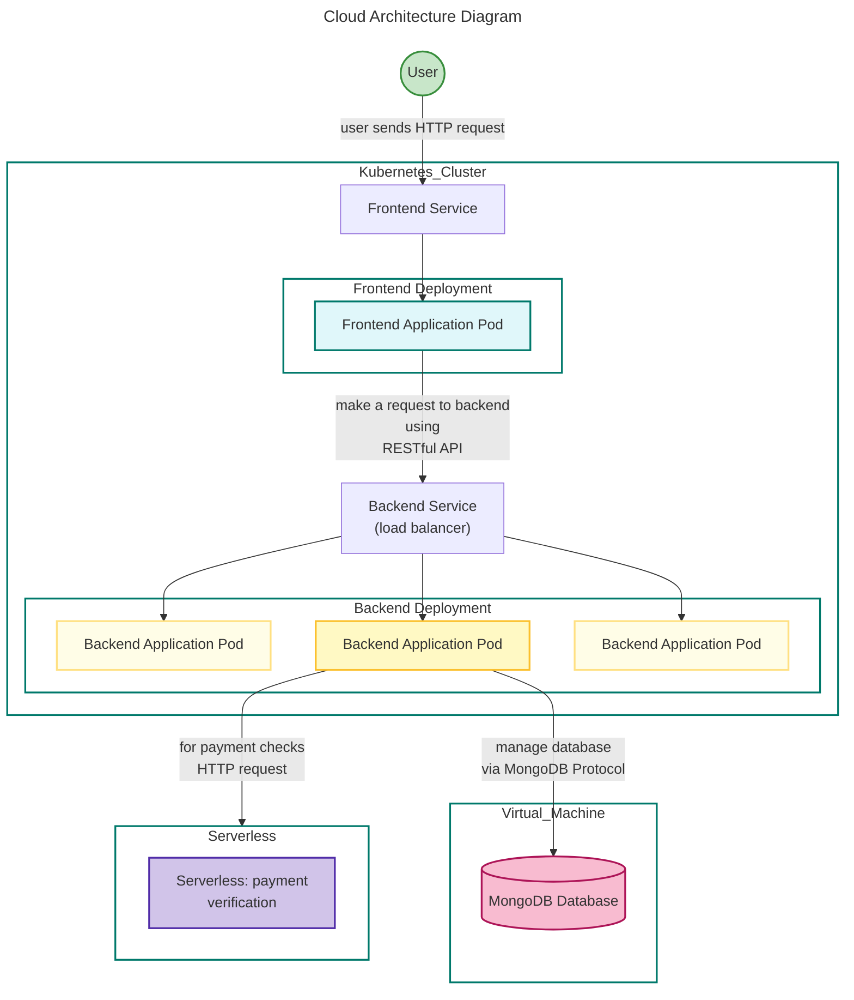
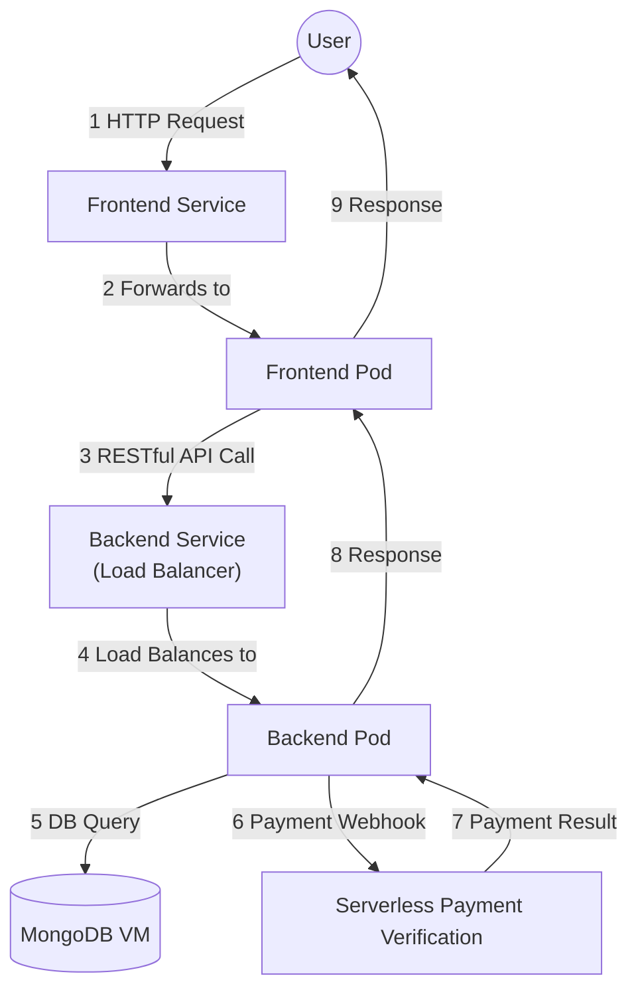

---

| Software component         | GCP service used     | Scalability                |
|-------------------|--------------------------|----------------------------|
| Frontend Server    | K8s (GKE)   | We did't specify a changing replica numbers for this but it could be horizontally scalable. Vertical, node pool configuration can be manually changed.          |
| Backend Server      | K8s (GKE) | Horizontal, via horizontal pod autoscaler based on load. Vertical, node pool configuration can be manually changed. |
| MongoDB           | Virtual Machine          | Vertical (manually)           |
| Payment Verification Function  | Serverless (Cloud Functions) |  Handled by GCP (horizontal, vertical)        |

---

### Runtime Flow Diagram

This diagram illustrates the flow of events between components during a typical user request, including frontend/backend routing, database access, and serverless payment verification.

---
