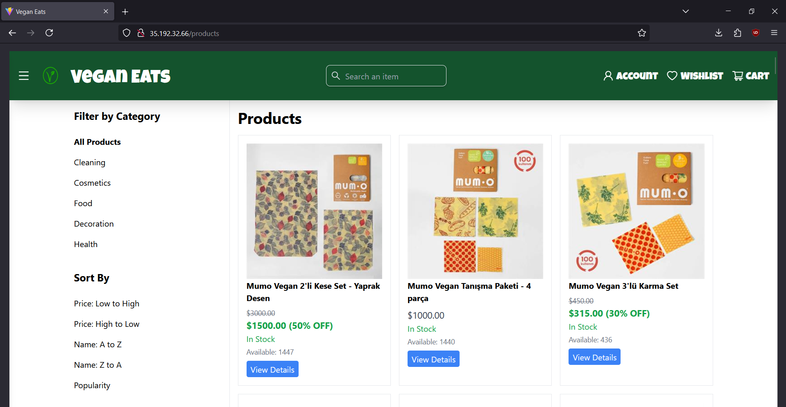
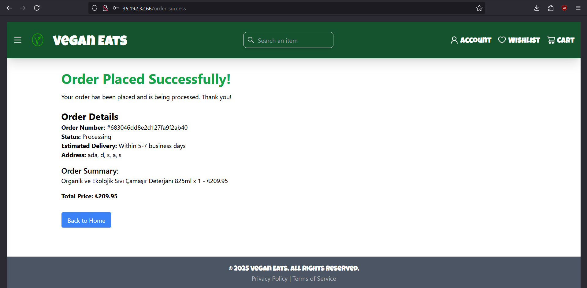
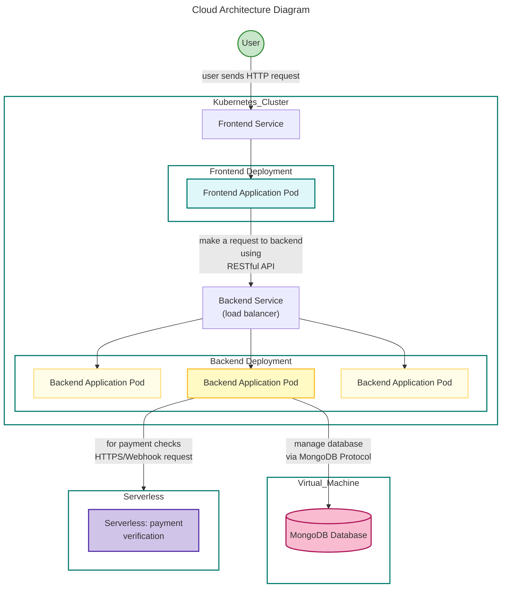

# Vegan Eats - Cloud-Native E-Commerce Platform







## Project Overview
Vegan Eats is an e-commerce application that we used for our CS436 Cloud Computing term project. Under the project, we deployed application on the google cloud demonstrating modern cloud architecture principles, utilizing containerization, and cloud-managed services.

## Application Architecture on the Cloud 




### Infrastructure Components
- **Kubernetes Orchestration**
  - Google Kubernetes Engine (GKE) for container orchestration
  - Horizontal Pod Autoscaling for dynamic scaling the backend pods
  - LoadBalancer service type for internal access
  - ConfigMaps and Secrets for configuration management

- **Container Registry**
  - Google Artifact Registry for container image management
  - Automated container builds and deployments
  - Version control and image tagging

- **Database Layer**
  - MongoDB deployment on VM
  - Persistent SSD for data persistence

- **Cloud Functions (Serverless Components)**
  - `paymentValidate`: Serverless payment processing [function code](./functions/paymentValidate/)

### Application Components

#### Frontend (React/Vite)
- https://github.com/nilsarisi/308_frontend.git
- Containerized React application [Dockerfile](./frontend/308_frontend/Dockerfile)
- Nginx-based reverse proxy
- Multiple specialized admin interfaces
- Deployed as Kubernetes pods with rolling updates

#### Backend (Node.js)
- https://github.com/cemrekkandemir/Vegan-Eats.git
- RESTful API containerized in Docker [Dockerfile](./backend/Vegan-Eats/Dockerfile)

- Horizontal scaling based on CPU/Memory metrics [HPA configuration](./k8s-configs/hpa.yaml)
- Health checks and readiness probes

#### Database (MongoDB)


## Deployment Infrastructure

### 1. Local Development Environment
- Docker Compose for local service orchestration [see docker-compose](./docker-compose.yaml)
- Minikube for local Kubernetes development
- Local MongoDB instance via Docker
- See [Local Setup Guide](./local-kubernetes.md)

### 2. Production Cloud Deployment
- **Google Cloud Platform (GCP)**
  - GKE cluster with node autoscaling, see [GKE Deployment Guide](./gke-setupt.md) and the [folder](./k8s-configs/)
  - Database on a vitrual machine with a linux server
  - You can create a VM and run the shell script [vm-db.sh] (./vm-db.sh)

## Performance and Reliability
- Testing with Locust (`./tests/locust-test.py`) while also changing the cloud architecture system parameters. (we talked about this in out presentation)
- Kubernetes liveness and readiness probes
- Automated scaling policicies
- Network policies for security

## Project Structure
```
project/
├── k8s-configs/           # Kubernetes manifests files
│   ├── backend-deployment.yaml
│   ├── frontend-deployment.yaml
│   └── ...more yaml files
|
├── backend/              # Backend source code and Dockerfile to containerize it.
├── frontend/             # Frontend source code and Dockerfile to containerize it. 
├── functions/            # The source codes for the functions we deployed on Cloud Run Functions
├── tests/                # testing realated information, locust test script and the results.
├── setup-commands/       # the instructions to create deploy the applicaion on google cloud.
└── setup-commands/docker-compose.yml    # Local development setup for debugging
```

## Testing

Locust Testing details and results can be found under the [test folder](./tests/) 